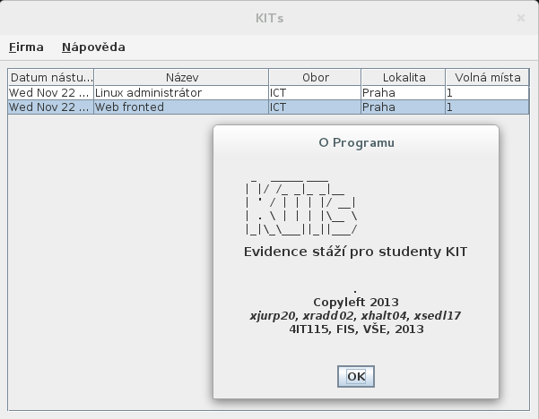
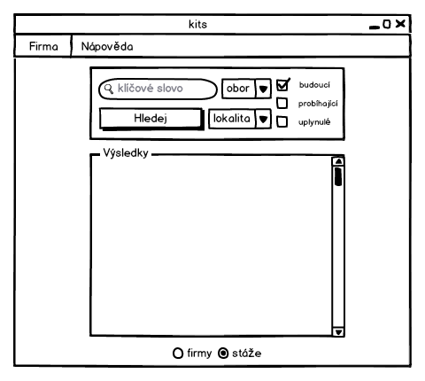
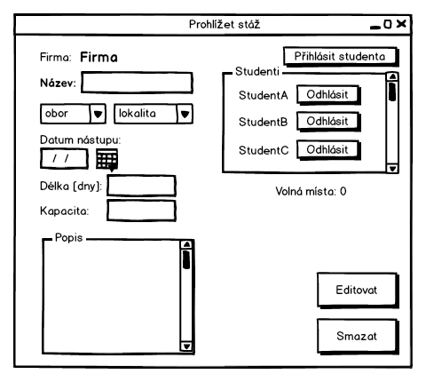
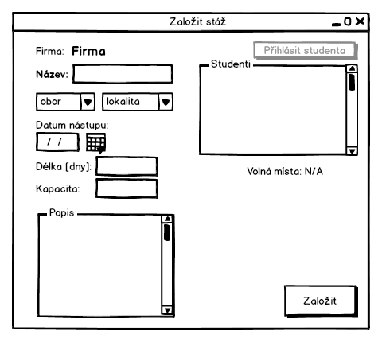
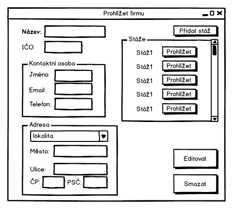
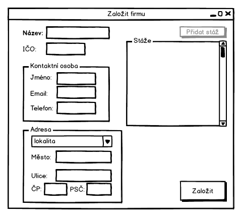

# kits \[[DOWNLOAD](download)\]

(c) 2013 Pavel Jurca, [University of Economics in Prague](https://isis.vse.cz/katalog/syllabus.pl?predmet=82362;typ=1;jazyk=3;vystup=1;lang=en)

## About

**MVP CRUD school project to keep a record of students internships**

Currently implements read only.

* XML Backend

## Mockups

### Log file

* Windows

  `%TMP%\kits.log`

* GNU/Linux

  `/tmp/kits.log`

